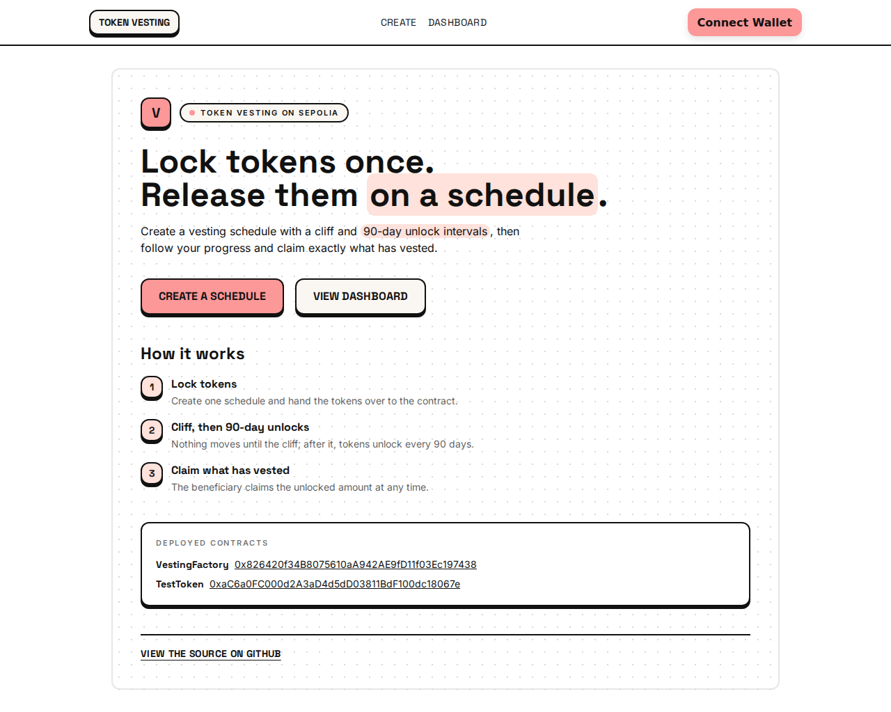
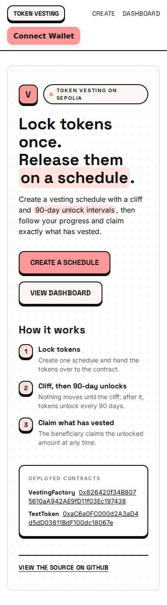
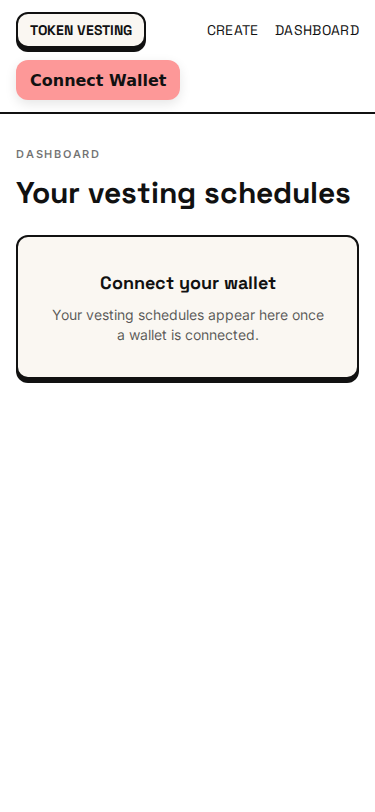
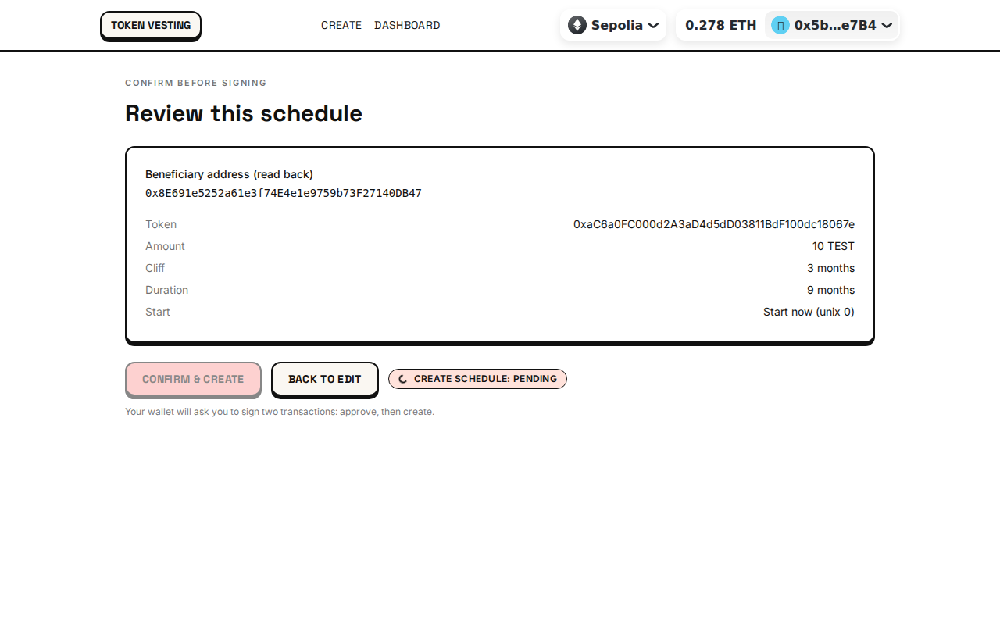
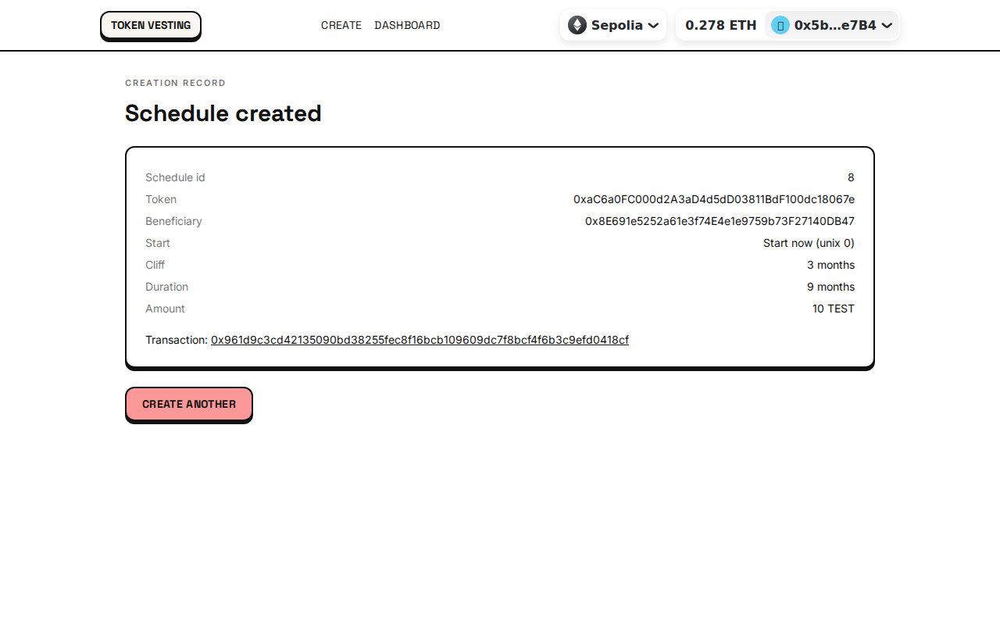
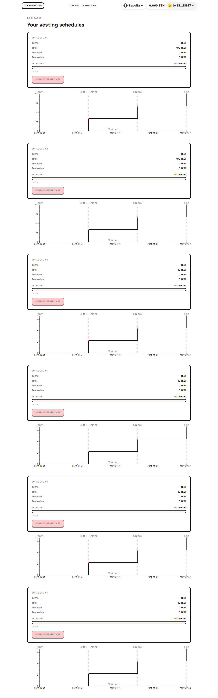

# Token Vesting

[](https://github.com/MohammedSoliman10/TokenVesting/actions/workflows/ci.yml)
[](https://github.com/MohammedSoliman10/TokenVesting/actions/workflows/live-check.yml)

A small spec-driven dApp for creating, viewing and claiming ERC-20 vesting
schedules: grantors lock tokens behind a cliff and 90-day release intervals in a
single unaudited factory contract; beneficiaries watch their vesting progress
on a responsive dashboard and claim exactly what has vested — with wallet and
network guards, transaction-status recovery, and a generated-artifacts handshake
that keeps the frontend and the contracts from ever drifting apart.

**Live site**: <https://token-vesting-lyart.vercel.app> — deployed on Vercel, talking to Sepolia.

## Live on Sepolia

| | |
| --- | --- |
| Network | Sepolia — chain id `11155111` |
| `VestingFactory` | [`0x826420f34B8075610aA942AE9fD11f03Ec197438`](https://sepolia.etherscan.io/address/0x826420f34B8075610aA942AE9fD11f03Ec197438) |
| `TestToken` | [`0xaC6a0FC000d2A3aD4d5dD03811BdF100dc18067e`](https://sepolia.etherscan.io/address/0xaC6a0FC000d2A3aD4d5dD03811BdF100dc18067e) |
| Deploy tx — TestToken | [`0xdab11ad3…4c69a5d5`](https://sepolia.etherscan.io/tx/0xdab11ad3248a39d7c43299f2f01741b714c07724c8c3c86ba7aa2aa24c69a5d5) |
| Deploy tx — VestingFactory | [`0x36601c0f…e95acf`](https://sepolia.etherscan.io/tx/0x36601c0f4ccd4fc34b3008a3b94dcc834dff33ecf187bec2f8540629ffe95acf) |
| Verification | Etherscan **and** Sourcify (both contracts, chain 11155111) |
| Live checks | `frontend/scripts/live-check.mjs` (shell/leaks) + `live-e2e.mjs` (stub wallet) |

Example schedules on the deployed factory:

| id | Beneficiary | Amount | Origin |
| -- | ----------- | ------ | ------ |
| 1 | `0x8E691e…27140DB47` (owner) | 100 TEST | Sepolia smoke run ([tx](https://sepolia.etherscan.io/tx/0xd0971ff61df6c80cdb01badb75d61cc87c3e9cecd25c0ffe134922f1c1681995)) |
| 3 | `0x5b7764…315Ce7B4` (deployer) | 100 TEST | Sepolia smoke run ([tx](https://sepolia.etherscan.io/tx/0xca4fce7c266f1ab8175bd188c0f74a1d0254a6da7e0028f35b232bbe43ba4aab)) |
| 6 | `0x8E691e…27140DB47` (owner) | 10 TEST | `live-e2e.mjs` passing run ([tx](https://sepolia.etherscan.io/tx/0xf6347485b19fc11484bb3e385d80b37ebaff9b4765b104ab3036f5ad48b68500)) |
| 7 | `0x8E691e…27140DB47` (owner) | 10 TEST | `live-e2e.mjs` re-run after the dependency fix ([tx](https://sepolia.etherscan.io/tx/0xaa717c31bf927657af1e6247641d5456d3a79241667420863a8943c7a1d34916)) |
| 8 | `0x8E691e…27140DB47` (owner) | 100 TEST | `live-e2e.mjs` run verifying the beneficiary read-back step in a real browser ([tx](https://sepolia.etherscan.io/tx/0x961d9c3cd42135090bd38255fec8f16bcb109609dc7f8bcf4f6b3c9efd0418cf)) |

Ids 2, 4 and 5 also exist on-chain and are deliberately **not** deleted: 2 is a
duplicate from a transient parser bug in the first smoke run, and 4 and 5 were
development attempts of `live-e2e.mjs`.

Screenshots are interleaved so the **deployed site** sits next to the **local
build** for the same viewport — any drift between them is visible at a glance.

**Desktop — 1280×800**

| Landing — live (deployed) | Landing — local build |
| ------------------------- | --------------------- |
|  |  |

**Mobile — 375×812**

| View | Live (deployed) | Local build |
| ---- | --------------- | ----------- |
| Landing |  |  |
| Dashboard |  |  |
| Create schedule | — |  |

**Live end-to-end run — real Sepolia tx, schedule id 7**

| Pending tx | Creation record | Beneficiary dashboard |
| ---------- | --------------- | --------------------- |
|  |  |  |

## Features

- **Atomic schedule creation** — `createSchedule` pulls the full amount from the
  grantor in the same transaction that stores the schedule; no schedule can exist
  unfunded, and fee-on-transfer tokens are rejected by a balance-delta check.
- **Cliff + 90-day intervals** — deterministic floor-division vesting, claimable
  by anyone but always paid to the beneficiary.
- **Dashboard (beneficiary view)** — schedules where the **connected wallet is
  the beneficiary** (v1 has no grantor dashboard; grantors get a confirmation
  view after creating a schedule), vesting progress, live claim buttons with
  pending/confirmed/failed status and pending-tx recovery.
- **Test-token faucet** — rate-limited (1,000 TEST / 24 h) for testnets.
- **Wallet & network guards** — wrong-network banner, connect prompts, and a
  clear notice when the contracts are not deployed on the connected chain.
- **Responsive & theme-verified** — Plinth design system
  ([`docs/design/theme.md`](docs/design/theme.md)), automated theme and
  responsive Playwright checks with committed screenshots.
- **Generated-artifact handshake** — addresses + ABIs are written by
  `script/Deploy.s.sol` into `frontend/src/contracts/` and committed; the UI
  never hand-copies an ABI.

## How vesting works

- **Months are 30 days.** A schedule has a `start`, a `cliff` (whole multiples of
  3 months), and a `duration` (whole multiples of 3 months, i.e. multiples of the
  90-day interval).
- Before the cliff: **nothing** is vested. At or after `start + duration`:
  **everything** is vested. In between, tokens vest once per **completed
  90-day interval**, with **floor division** (no partial intervals, never rounds
  up):

  ```
  vested = totalAmount × completedIntervals / totalIntervals
  completedIntervals = (now − start) / 90 days      totalIntervals = duration / 90 days
  ```

- **Example:** 900 TEST over 9 months (cliff 3 months, 3 intervals):

  | Time after `start` | Vested | Claimable |
  | ------------------ | ------ | --------- |
  | day 89 (pre-cliff) | 0 | 0 — `release` reverts `NothingToRelease()` |
  | day 90 | 900 × 1/3 = **300** | 300 |
  | day 180 | 900 × 2/3 = **600** | 300 more (600 − 300 already released) |
  | day 270 (= duration) | **900** | the remaining 300 |

  Floor division shows up with indivisible amounts too: 5 wei over 2 intervals
  vests `floor(5 × 1 / 2) = 2` wei after interval 1 and the full 5 after
  interval 2.

## Architecture

```
┌──────────────────────────┐   forge script script/Deploy.s.sol   ┌──────────────────────────────────┐
│ Foundry contracts        │ ───────────────────────────────────► │ frontend/src/contracts/ (GENERA- │
│  src/VestingFactory.sol  │   writes, committed on purpose:      │  TED, committed):                │
│  src/TestToken.sol       │   • deployments.json (per chain id)  │  • deployments.json              │
│  script/Deploy.s.sol     │   • abis/*.json                      │  • abis/{VestingFactory,TestToken}│
└────────────┬─────────────┘                                      └───────────────┬──────────────────┘
             │ deploy (anvil / Sepolia)                            imported by    │
             ▼                                                                 ▼
┌──────────────────────────┐   wagmi + viem (reads batched via Multicall3, ┌──────────────────────────┐
│ EVM node (RPC)           │ ◄── writes via wallet, ABI decode, zod ──────► │ frontend (Vite + React)  │
│  anvil 31337 / Sepolia   │       validated forms, tx-status hooks)       │  RainbowKit + wagmi      │
└──────────────────────────┘                                               └──────────────────────────┘
```

The handshake is one-way: contracts → generated artifacts → frontend. Deploying
regenerates `frontend/src/contracts/`, which you commit so every environment
(Vercel included) builds against the real addresses.

## Project layout

| Path | What it is |
| ---- | ---------- |
| `src/` | `VestingFactory` (all schedules, one address) + `TestToken` (testnet token + faucet) |
| `test/` | Unit, fuzz and invariant Foundry tests (+ `test/mocks/` adversarial tokens) |
| `script/Deploy.s.sol` | Deploys both contracts, writes addresses + ABIs into the frontend |
| `script/smoke.sh` | End-to-end claim flow against a local anvil via `cast` |
| `script/coverage-gate.sh` | Fails below 95% line coverage on `src/` |
| `frontend/` | Vite + React + TypeScript app (Plinth theme, wagmi/RainbowKit) |
| `frontend/src/contracts/` | **Generated** `deployments.json` + `abis/` (committed) |
| `frontend/scripts/` | `responsive-check.mjs`, `theme-check.mjs`, plus the live-site checks `live-check.mjs` and `live-e2e.mjs` |
| `docs/design/` | "Plinth" design system (`theme.md`, `theme.png`) |
| `docs/screenshots/` | Committed screenshots used in this README |
| `docs/SECURITY-REVIEW.md` | Security review: findings, slither, gas, limitations |
| `specs/001-token-vesting-app/` | Spec, plan, research, data model, tasks, quickstart |

## Local run

```bash
# 1. Chain (terminal A) — anvil, chain id 31337
anvil

# 2. Contracts (terminal B) — deploy with anvil's unlocked account #0
forge script script/Deploy.s.sol:Deploy \
  --rpc-url http://127.0.0.1:8545 --broadcast --unlocked \
  --sender 0xf39Fd6e51aad88F6F4ce6aB8827279cffFb92266

# 3. Frontend (terminal B)
cd frontend
npm ci
cp .env.example .env.local    # then set VITE_CHAIN_ID=31337
npm run dev                   # reads .env.local (VITE_CHAIN_ID=31337)
```

**MetaMask setup:** add a network with RPC `http://127.0.0.1:8545`, chain id
`31337`, currency `ETH`, and import anvil account #0 (or #1) using its
**publicly known dev key** printed by `anvil`. Those keys are for local testing
only — never reuse them on a real network.

## Tests & gates

```bash
# Contracts — unit + fuzz + invariant (fixed seed 0x5eed): 62 test functions.
forge test
FOUNDRY_PROFILE=ci forge test      # what CI runs: fuzz 512, invariants 128

# Coverage gate — fails below 95% line coverage on src/
./script/coverage-gate.sh

# Gas snapshot — committed as .gas-snapshot (61 entries: every unit/fuzz test
# plus all 6 invariants individually). CI runs the same suite, so an
# unexpected gas change shows up as a diff on this file.
forge snapshot
# Frontend — lint, typecheck, 211 tests, build
cd frontend
npm run lint && npm run typecheck && npm test && npm run build

# Browser checks (Playwright) — each script spawns its OWN `vite preview`
# (ports 4173/4174) and serves dist/, so: run `npm run build` first, and start
# NO dev server.
npm run build
node scripts/responsive-check.mjs
node scripts/theme-check.mjs

# Live checks against the DEPLOYED site (no wallet needed; the e2e run injects
# a stub window.ethereum — the signing key is passed ONLY via the E2E_PK env
# var of that one command, never committed):
node scripts/live-check.mjs https://token-vesting-lyart.vercel.app
E2E_ADDRESS=0x… E2E_RPC=<sepolia-rpc> node scripts/live-e2e.mjs \
  https://token-vesting-lyart.vercel.app owner            # read-only run

# End-to-end smoke: faucet → approve → create → warp → claim (anvil must be
# running with the contracts deployed, and `node` + `cast` on PATH)
./script/smoke.sh
```

Merge gates (also run by CI in `.github/workflows/ci.yml`):

```bash
forge fmt --check && forge build --deny warnings && forge test && ./script/coverage-gate.sh
cd frontend && npm run lint && npm run typecheck && npm test && npm run build
```

CI runs the two browser checks as well (after the build), and a separate
[`live-check.yml`](.github/workflows/live-check.yml) workflow re-runs
`live-check.mjs` against the **production** URL every day — CI proves the repo
builds, the daily run proves the deployed site still serves a working app.

Each CI run also uploads its `lcov.info` as the `coverage-lcov` artifact (on
success *and* on failure, since a failed gate is when you want to read it), and
the [`v1.0.0` release](https://github.com/MohammedSoliman10/TokenVesting/releases/tag/v1.0.0)
carries `gas-snapshot.txt` and `lcov.info` as evidence.

## Environment

| Variable | Purpose |
| -------- | ------- |
| `VITE_CHAIN_ID` | `31337` (local anvil) or `11155111` (Sepolia, default) |
| `VITE_WALLETCONNECT_PROJECT_ID` | WalletConnect Cloud project id — free at <https://cloud.reown.com> (or cloud.walletconnect.com) |
| `VITE_RPC_URL` | Optional custom RPC; defaults to viem's public RPC for the chain |

Copy [`frontend/.env.example`](frontend/.env.example) to `frontend/.env.local`.
`.env*` files are gitignored — only the example template is committed.

## Deploying contracts (Sepolia, keystore)

Use a Foundry keystore so the private key never touches the repo or shell
history:

```bash
# one-time: import the key interactively (stored encrypted in ~/.foundry/keystores)
cast wallet import deployer --interactive

# deploy (keystore prompts for the password; never pass a raw key)
forge script script/Deploy.s.sol:Deploy \
  --rpc-url "$SEPOLIA_RPC_URL" --account deployer --broadcast

# the script rewrote addresses + ABIs — commit them so the frontend builds
git add frontend/src/contracts && git commit -m "chore: record Sepolia deployment"
```

**Never commit or paste raw keys.** Keystores only (`cast wallet import` +
`--account`), exactly as CI and the security review assume.

## Deploying the frontend (Vercel)

- **Root directory:** `frontend` · **Framework:** Vite · **Build command:**
  `npm run build` · **Output directory:** `dist`
- **Environment variables** (production, as configured):
  - `VITE_CHAIN_ID` = `11155111`
  - `VITE_RPC_URL` = `https://ethereum-sepolia-rpc.publicnode.com`
  - `VITE_WALLETCONNECT_PROJECT_ID` = optional — **not set**; the app falls
    back to the default id, which is fine for injected wallets (MetaMask).
    Set it (free at <https://cloud.reown.com>) to enable WalletConnect pairing,
    then redeploy.
  - Never put an archive-node API key in `VITE_*` vars — they are baked into
    the public JS bundle.
- After the first deploy, **add the Vercel domain to the allowed domains** in
  your WalletConnect/Reown project settings (Project → Allowed domains), or
  WalletConnect connections will be refused on that origin.

## Spec-driven development

This project is built with GitHub's **Spec Kit** workflow: a constitution sets
the engineering rules (TDD, ≥ 95% coverage, merge gates), then each feature goes
`/speckit.specify` → `/speckit.plan` → `/speckit.tasks` → `/speckit.implement`
(waves of test-first tasks) → `/speckit.checklist`. The full spec, plan,
research, data model and task list live in
[`specs/001-token-vesting-app/`](specs/001-token-vesting-app/) — the task file
records every task together with the evidence that closed it, and all **68**
are checked off, including the items that were open for the longest (local
deploy, live URL, quickstart run, the release PR).

## Security

See **[`docs/SECURITY-REVIEW.md`](docs/SECURITY-REVIEW.md)** for the full review:
CEI/re-entrancy analysis (including the `createSchedule` guard added with a
red→green adversarial test), slither results, contract sizes and gas, numeric
bounds, and the secrets/push-readiness scan.

## Known limitations

Copied from the security review (§7) — read the
[full review](docs/SECURITY-REVIEW.md) for context:

1. **No revocation** — a wrong beneficiary address locks the tokens until
   `start + duration`, when only that address can claim. The create form has one
   beneficiary input validated with viem's `isAddress` (mixed-case input with a
   wrong EIP-55 checksum **is** rejected; all-lowercase input passes), and a valid
   submit now stops at a **review step** that reads the address back in canonical
   EIP-55 form, warns when it was typed all-lowercase (checksum unverified), and
   requires an explicit *Confirm & create* before the wallet is prompted. That
   makes a wrong address much less likely — it does not make it impossible
   (revocation is still not a feature): **paste, don't type**, and read the
   read-back before confirming.
2. **No admin / no pause** — immutable by design; nothing can be frozen later.
3. **Shared pool** — all grantors' funds for the same token live in one contract;
   per-schedule accounting keeps releases independent.
4. **Fee-on-transfer and rebasing tokens are rejected** at creation.
5. **Test-token faucet has unlimited supply** — testnet only, never mainnet.
6. **Extreme amounts** above the per-duration overflow bound (e.g. above
   ≈ 2.97 × 10⁵⁷ tokens for a 120-month schedule; higher for shorter
   durations) can panic mid-schedule — see the overflow section of the review.
7. **30-day months, rigid shape** — cliffs/durations in whole multiples of 3
   months; no arbitrary schedules.
8. **Permissionless release** — anyone may trigger a claim, but it always pays
   the beneficiary.
9. **Unaudited** — one engineer plus slither and 62 tests is not an audit;
   **not for mainnet with real value.**
